# Buck-Based CC-CV Lithium-Ion Battery Charger Simulation & Control

[-green.svg)](#closed-loop-control-architecture)

**Author**: **Shourya Khanna**  
**Affiliation**: Department of Electronics and Telecommunication Engineering, Sardar Patel Institute of Technology, Andheri, Mumbai, Maharashtra, India  
**Repository**: [https://github.com/Shouryak07/Buck-CC-CV-Li-ion-Charger](https://github.com/Shouryak07/Buck-CC-CV-Li-ion-Charger/tree/main)  
**Research Documentation**: [Documentation/Buck_CC_CV_Li_Ion_Charger_Simulation_and_Control.pdf](Documentation/Buck_CC_CV_Li_Ion_Charger_Simulation_and_Control.pdf)

An end-to-end power electronics and embedded control engineering project demonstrating the design, mathematical modeling, simulation, and closed-loop control of a **Constant Current – Constant Voltage (CC-CV) Lithium-Ion Battery Charger** implemented in **MATLAB, Simulink, and Simscape Electrical**.

---

## Table of Contents
1. [Executive Summary](#executive-summary)
2. [Dual-Model Simulation Methodology](#dual-model-simulation-methodology)
3. [Power Stage Specifications and Governing Equations](#power-stage-specifications-and-governing-equations)
4. [Closed-Loop Control Architecture](#closed-loop-control-architecture)
5. [Battery Modeling Evolution](#battery-modeling-evolution)
6. [Key Simulation Results](#key-simulation-results)
   - [A. Open-Loop Characterization and Diode Drop Validation](#a-open-loop-characterization-and-diode-drop-validation)
   - [B. Closed-Loop Constant Current (CC) Regulation](#b-closed-loop-constant-current-cc-regulation)
   - [C. Complete 35-Second CC-to-CV Transition Cycle](#c-complete-35-second-cc-to-cv-transition-cycle)
7. [Engineering Problems Solved and Debugging Trajectory](#engineering-problems-solved-and-debugging-trajectory)
8. [How to Run the Simulations](#how-to-run-the-simulations)
9. [Model Limitations and Hardware Roadmap](#model-limitations-and-hardware-roadmap)
10. [References](#references)

---

## Executive Summary

The objective of this project is to develop and validate a robust, digitally controlled buck converter designed to recharge a single-cell Lithium-Ion battery across its full charging profile:
1. **Constant Current (CC) Mode**: Regulating charging current strictly at **$1.0\text{ A}$** while battery terminal voltage rises from its depleted state ($20\%\text{ SOC} \approx 3.56\text{ V}$).
2. **Constant Voltage (CV) Mode**: Clamping the cell voltage smoothly at the safe target ceiling of **$4.19\text{ V}$** while charging current naturally tapers to prevent overcharging.
3. **Autonomous Transition**: Seamlessly handing over duty cycle authority via a hardware-defensible **Minimum Selection** logic without mode-switching chatter or integrator windup.

A defining highlight of this project is the resolution of the classical **multi-scale simulation dilemma** in power electronics: resolving switching dynamics at $100\text{ kHz}$ ($10\ \mu\text{s}$ period) versus battery electrochemistry across thousands of seconds. This challenge is addressed through a rigorous **dual-model framework** adhering to industrial power engineering standards.

  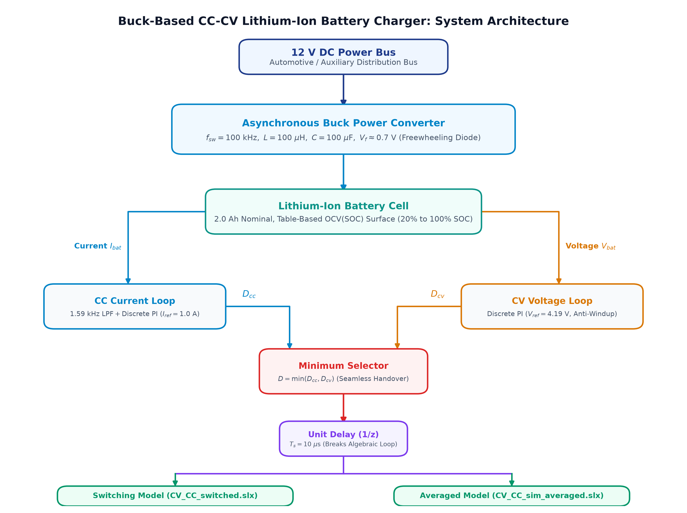
   
  <em>Fig. 1. End-to-end system architecture of the buck-based CC-CV Lithium-Ion charger, showing dual-loop feedback, autonomous minimum-selection arbitration, and the dual-model simulation pipeline.</em>

---

## Dual-Model Simulation Methodology

Power electronic systems charging electrochemical storage span two radically divergent time scales:
* **Switching Level ($\sim 10\ \mu\text{s}$)**: Parasitics, gate driving, diode recovery, inductor current ripple $\Delta I_L$, and output capacitor voltage ripple $\Delta V_C$.
* **Charging Level ($\sim 10^3 - 10^4\text{ s}$)**: Coulomb counting, OCV growth, electrochemical equilibrium, and thermal drift.

Simulating a 2 Ah cell charged at 1 A requires $1.6\text{ hours}$ ($5,760\text{ seconds}$). At $100\text{ kHz}$, a switching model would demand $5.76 \times 10^8$ switching cycles and billions of stiff variable-step solver evaluations, making full-cycle switching simulation computationally intractable.

Rather than artificially corrupting physical parameters (such as faking SOC integration gains), this project implements the standard aerospace/automotive **two-model methodology**:

| Feature | Model A: Detailed Switching Model (`CV_CC_switched.slx`) | Model B: Averaged Dynamic Model (`CV_CC_sim_averaged.slx`) |
| :--- | :--- | :--- |
| **Topology** | Simscape MOSFET, Diode, L-C Filter, Table-Based Battery | Controlled Voltage Source ($V_{avg} = D \cdot V_{in}$), L-C Filter, Battery |
| **PWM Generation** | 100 kHz Carrier-based PWM block | Direct cycle-averaged duty modulation |
| **Target Phenomenon** | Switching ripple, peak inductor current, semiconductor conduction | Multi-second dynamic trajectory, CC-to-CV transition, loop handover |
| **Time Horizon** | $0\text{ to }50\text{ ms}$ | $0\text{ to }35\text{ s}$ (Accelerated capacity: $0.01\text{ Ah}$) |
| **Numerical Solver** | `ode23t` (Moderately stiff, trapezoidal rule) | `ode23t` / `ode45` |
| **Computational Cost** | High ($\sim 10^5$ steps per second of simulated time) | Extremely fast ($< 3\text{ seconds}$ execution time) |

  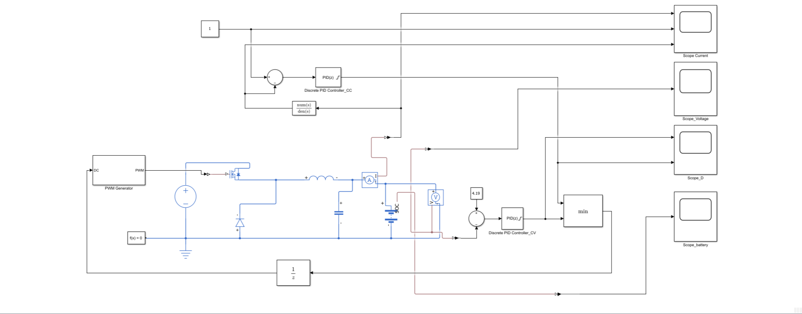
   
  <em>Fig. 2. Complete Simscape electrical schematic of the detailed closed-loop 100 kHz switching CC-CV Li-Ion charger (CV_CC_switched.slx).</em>

  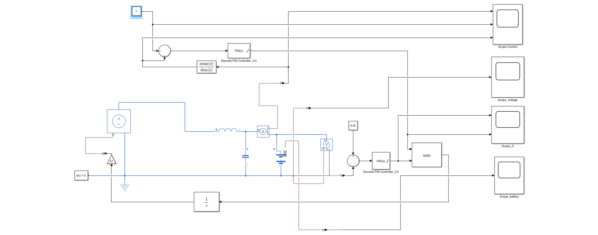
   
  <em>Fig. 3. Cycle-averaged dynamic simulation model (CV_CC_sim_averaged.slx) for long-horizon electrochemical charging validation.</em>

---

## Power Stage Specifications and Governing Equations

### Converter Parameters

| Parameter | Symbol | Nominal Value | Rationale |
| :--- | :---: | :---: | :--- |
| Input DC Bus Voltage | $V_{in}$ | $12.0\text{ V}$ | Standard automotive / auxiliary DC power bus |
| Battery Nominal / Cutoff | $V_{bat}$ | $3.6\text{ V}$ nom / $4.19\text{ V}$ max | Single-cell Lithium-ion chemistry |
| Switching Frequency | $f_{sw}$ | $100\text{ kHz}$ | Optimal tradeoff between magnetic volume and MOSFET losses |
| Switching Period | $T_{sw}$ | $10.0\ \mu\text{s}$ | $T_{sw} = 1 / f_{sw}$ |
| Power Inductor | $L$ | $100\ \mu\text{H}$ | Sets ripple current $\Delta I_L \approx 20 - 25\%$ of rated current |
| Output Filter Capacitor | $C$ | $100\ \mu\text{F}$ | Attenuates switching voltage ripple to millivolt scale |
| Diode Forward Voltage Drop | $V_f$ | $\approx 0.70\text{ V}$ | Piece-wise linear power diode forward drop |
| Initial Resistive Benchmark | $R_{load}$ | $10.0\ \Omega$ | Baseline stage test prior to electrochemical loading |

### Non-Ideal Buck Conversion Governing Equation
In an asynchronous buck converter with a non-zero freewheeling diode forward drop $V_f$:
* During ON-state ($t \in [0, D T_{sw}]$): Node voltage $V_x = V_{in}$.
* During OFF-state ($t \in [D T_{sw}, T_{sw}]$): Inductor current forces freewheeling diode conduction, clamping $V_x = -V_f$.

The exact volt-second balance yields the steady-state output voltage:
$$V_{out} = D \cdot V_{in} - (1 - D) \cdot V_f$$

For $V_{in} = 12\text{ V}$, $D = 0.35$, and $V_f = 0.7\text{ V}$:
$$V_{out} = (0.35 \times 12) - (0.65 \times 0.70) = 4.20 - 0.455 = 3.745\text{ V}$$
*Experimental validation*: The Simscape switched simulation yielded **$3.7358\text{ V}$** (within $0.24\%$ of theoretical prediction).

### Inductor Current Ripple ($\Delta I_L$)
During the ON-time $T_{on} = D \cdot T_{sw} = 0.35 \times 10\ \mu\text{s} = 3.5\ \mu\text{s}$ (at nominal $V_{out} \approx 3.7\text{ V}$, $T_{on} \approx 3.1\ \mu\text{s}$):
$$\Delta I_L = \frac{V_{in} - V_{out}}{L} \cdot T_{on} = \frac{12 - 3.7}{100 \times 10^{-6}} \cdot 3.1 \times 10^{-6} \approx 0.257\text{ A peak-to-peak}$$
*Simulated Ripple*: Measured peak-to-peak current ripple in Simscape scope cursors is **$\Delta I_L = 213.6\text{ mA}$** (with $I_{max} = 1.069\text{ A}$, $I_{min} = 0.856\text{ A}$, mean $= 0.956\text{ A}$), perfectly aligning with theoretical design margins.

---

## Closed-Loop Control Architecture

  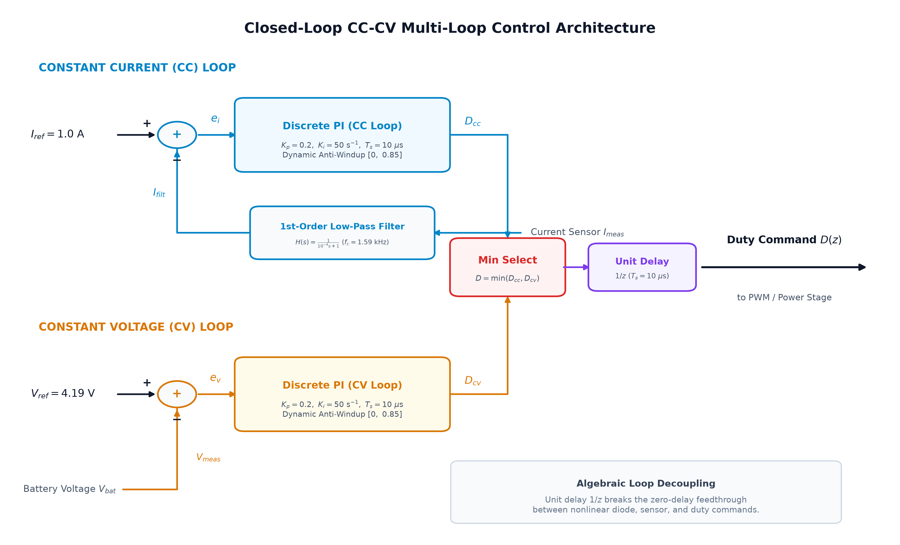
   
  <em>Fig. 4. Closed-loop multi-loop control architecture featuring 1.59 kHz low-pass feedback filtering, discrete PI regulation, dynamic anti-windup clamping, autonomous minimum selection, and unit-delay algebraic loop decoupling.</em>

### 1. Current Feedback Low-Pass Filtering
Feeding raw switching current directly into high-gain PI loops introduces chattering, actuator jitter, and numerical instability due to $100\text{ kHz}$ switching harmonics. A continuous-time first-order filter was incorporated in the feedback path:
$$H(s) = \frac{1}{10^{-4} s + 1} \implies f_c = \frac{1}{2\pi \times 10^{-4}} \approx 1.59\text{ kHz}$$
This provides $-36\text{ dB}$ attenuation at $100\text{ kHz}$ switching frequency while preserving transient responsiveness up to $1.5\text{ kHz}$.

### 2. Discrete PI Parameterization
Both loops utilize a **Discrete PI Controller** sampled at $T_s = 10\ \mu\text{s}$ ($100\text{ kHz}$, synchronous with PWM):
* **Proportional Gain ($K_p$)**: $0.2$
* **Integral Gain ($K_i$)**: $50\text{ s}^{-1}$
* **Derivative Gain ($K_d$)**: $0$
* **Output Saturation**: Clamped between $D_{min} = 0.0$ and $D_{max} = 0.85$
* **Anti-Windup Method**: Dynamic clamping (freezes integrator state when actuator limits are violated).

### 3. Smooth Minimum Selection & Algebraic Loop Elimination
* **Autonomous Mode Arbitration**: Rather than state-machine logic that can stutter at boundaries, the duty command is arbitrated continuously:
  $$D = \min(D_{cc}, D_{cv})$$
  In CC mode, $V_{bat} < V_{ref} \implies D_{cv} = 0.85$ (saturated), so $D_{cc} \approx 0.30 - 0.35$ wins. When $V_{bat} \to 4.19\text{ V}$, $D_{cv}$ decreases below $D_{cc}$, seamlessly taking command without current spikes.
* **Algebraic Loop Resolution**: The direct coupling between controller output, PWM, Simscape non-linear diodes, and sensors creates a zero-delay algebraic feedback loop. Inserting a **Unit Delay ($1/z$, $T_s = 10\ \mu\text{s}$, initial condition $= 0.35$)** cleanly broke the feedthrough dependency while matching the exact one-cycle computation latency of physical digital controllers.

---

## Battery Modeling Evolution

### Stage 1: Custom Physical Integrator Model
* Implemented via explicit mathematical blocks:
  $$SOC(t) = SOC_0 + \frac{1}{C_{bat}} \int_0^t I_{bat}(\tau) d\tau$$
  with $C_{bat} = 2\text{ Ah} = 7200\text{ A}\cdot\text{s}$, $SOC_0 = 0.20$.
* 1-D Lookup Table mapped SOC to Open Circuit Voltage:
  - Breakpoints: `[0.0, 0.2, 0.4, 0.6, 0.8, 1.0]`
  - OCV (V): `[3.20, 3.55, 3.65, 3.75, 3.95, 4.20]`
* In series with internal resistance $R_{int} = 0.1\ \Omega$:
  $$V_{terminal} = V_{ocv} + I_{bat} \cdot R_{int} = 3.56\text{ V} + (0.8\text{ A} \times 0.1\ \Omega) = 3.64\text{ V}$$
  *Validated experimentally*: Measured terminal voltage reached exactly **$3.6388\text{ V}$**.

  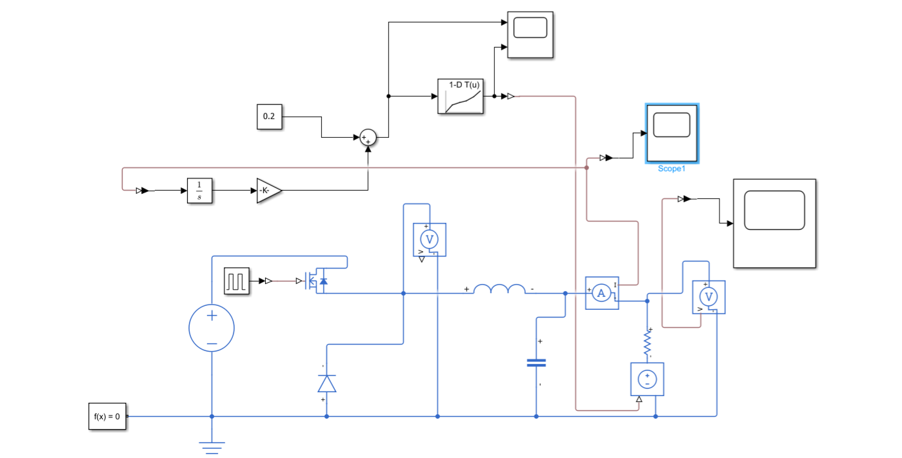
   
  <em>Fig. 5. Simulink block diagram of the custom physical battery macro-model with Coulomb counting integration and 1-D OCV lookup table.</em>

### Stage 2: Simscape Table-Based Li-Ion Battery
To eliminate simplified macro-modeling limitations, the circuit was upgraded to the official **Simscape Electrical Table-Based Battery** featuring 2D thermal/state lookup tables:
* **Capacity**: $2.0\text{ Ah}$
* **Initial State of Charge**: $20\%$
* **Temperature Vector**: `[278, 293, 313] K`
* **OCV Surface**: Peak voltage reaches $4.19\text{ V}$ at $100\%\text{ SOC}$. (Hence, CV reference was tuned to $4.19\text{ V}$ to prevent unreachable integrator windup).

### Stage 3: Capacity-Scaled Accelerated Demonstration
To simulate the complete $20\% \to 100\%\text{ SOC}$ charging profile in a tractable simulation run without altering physics:
$$Q_{needed} = (1.0 - 0.2) \times C_{demo} = 0.8 \times 0.01\text{ Ah} = 0.008\text{ Ah} = 28.8\text{ A}\cdot\text{s}$$
At $I_{charge} = 1.0\text{ A}$, the required CC charging duration is:
$$t_{cc} = \frac{28.8\text{ A}\cdot\text{s}}{1.0\text{ A}} = 28.8\text{ seconds}$$
This enabled full validation over a **$35.0\text{ s}$** simulation window.

---

## Key Simulation Results

### A. Open-Loop Characterization and Diode Drop Validation
Fixed-duty open-loop tests confirmed duty linearity and verified the impact of diode drop:

| Duty Cycle ($D$) | Theoretical Ideal ($D \cdot 12\text{ V}$) | Calculated with Diode Drop ($V_f = 0.7\text{ V}$) | Measured Output Voltage | Relative Deviation |
| :---: | :---: | :---: | :---: | :---: |
| **20%** | $2.40\text{ V}$ | $1.84\text{ V}$ | **$1.87\text{ V}$** | $+1.6\%$ |
| **30%** | $3.60\text{ V}$ | $3.11\text{ V}$ | **$3.11\text{ V}$** | $0.0\%$ |
| **35%** | $4.20\text{ V}$ | $3.745\text{ V}$ | **$3.736\text{ V}$** | $-0.2\%$ |
| **40%** | $4.80\text{ V}$ | $4.38\text{ V}$ | **$4.36\text{ V}$** | $-0.4\%$ |
| **50%** | $6.00\text{ V}$ | $5.65\text{ V}$ | **$5.601\text{ V}$** | $-0.8\%$ |
| **60%** | $7.20\text{ V}$ | $6.92\text{ V}$ | **$6.90\text{ V}$** | $-0.3\%$ |

  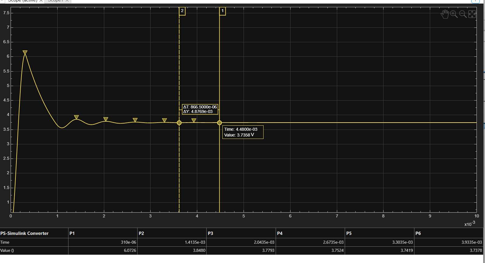
   
  <em>Fig. 6. Open-loop step response at D = 35% settling to 3.7358 V with cursor measurements (peak 6.07 V at 310 µs, damped within 4.5 ms).</em>

### B. Closed-Loop Constant Current (CC) Regulation
* **Tracking Accuracy**: Under closed loop with $I_{ref} = 1.0\text{ A}$, the battery charging current locked onto $1.0\text{ A}$ within **$12\text{ ms}$** without overshoot.
* **Harmonic Attenuation**: Raw inductor current oscillated between $0.856\text{ A}$ and $1.069\text{ A}$ ($\Delta I_L = 213.6\text{ mA}$ at $100\text{ kHz}$), while filtered feedback current remained steady at $0.99\text{ A}$.

  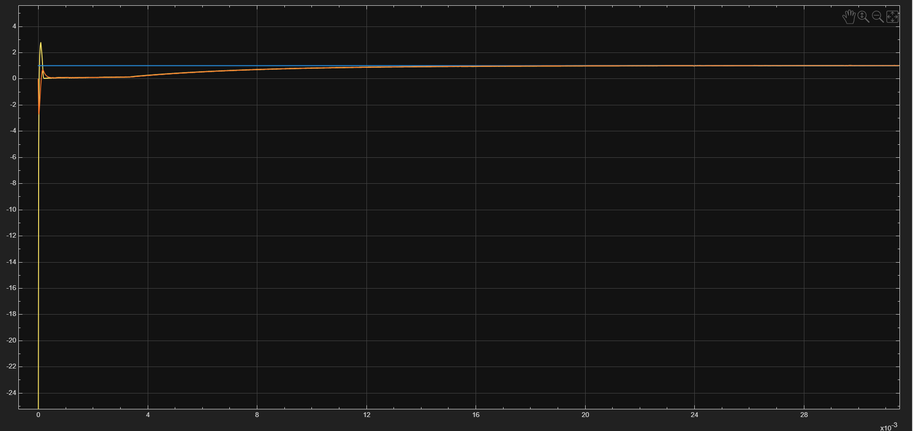
   
  <em>Fig. 7. Closed-loop Constant Current step transient over 30 ms showing rapid settling of filtered current to 1.0 A within 12 ms.</em>

  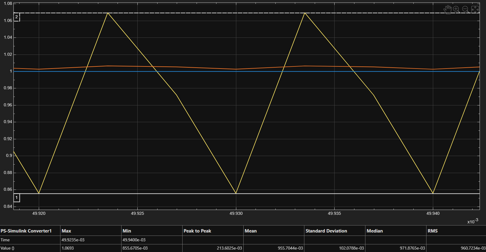
   
  <em>Fig. 8. High-resolution steady-state current waveform showing triangular inductor ripple (&Delta;I_L = 213.6 mA pk-pk) and smoothed 0.99 A filtered feedback.</em>

### C. Complete 35-Second CC-to-CV Transition Cycle
Simulated in `CV_CC_sim_averaged.slx` over $t \in [0, 35\text{ s}]$:
* **$t = 0\text{ to }28.8\text{ s}$ (CC Mode)**:
  - Charging current held rock-solid at **$1.0\text{ A}$**.
  - Battery voltage climbed steadily from $3.61\text{ V}$ to $4.18\text{ V}$.
  - CC duty $D_{cc}$ gradually ramped from $0.30$ to $0.35$ to overcome rising battery counter-EMF.
  - CV loop was saturated at $D_{cv} = 0.85$; Min block passed $D_{cc}$.
* **$t = 29\text{ to }32\text{ s}$ (Handover Phase)**:
  - Terminal voltage reached $4.19\text{ V}$.
  - CV error approached zero, prompting $D_{cv}$ to desaturate and decline from $0.85$ towards $0.35$.
* **$t \ge 32\text{ s}$ (CV Mode)**:
  - At $t \approx 32.1\text{ s}$, $D_{cv} < D_{cc}$. Min block smoothly handed duty control to the CV controller.
  - Terminal voltage was clamped precisely at **$4.19\text{ V}$**.
  - Charging current dropped sharply towards $0\text{ A}$, safely terminating charge.

  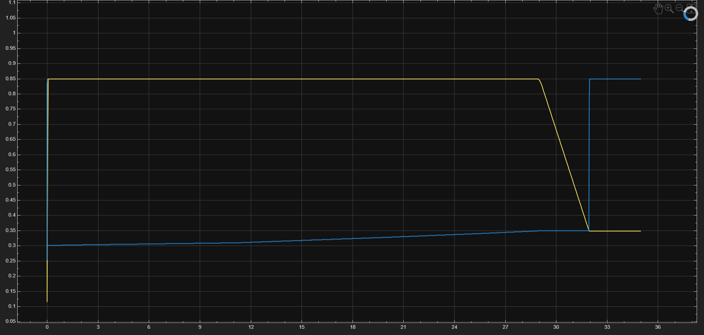
   
  <em>Fig. 9. Scope_D trace showing duty cycle commands D_cc (blue) and D_cv (yellow) during the autonomous handover at t &approx; 32 s.</em>

  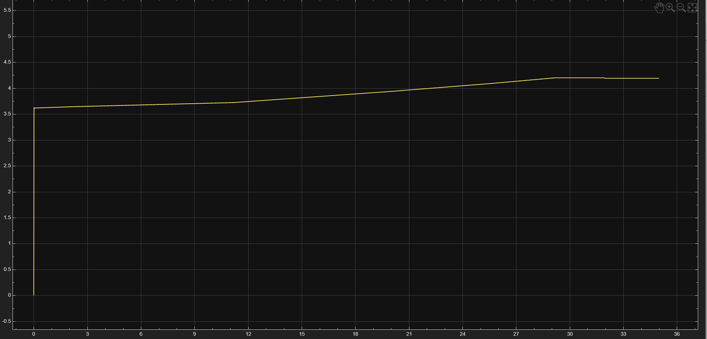
   
  <em>Fig. 10. Battery terminal voltage trajectory over 35 s accelerated simulation, rising linearly in CC mode and clamping at 4.19 V in CV mode.</em>

  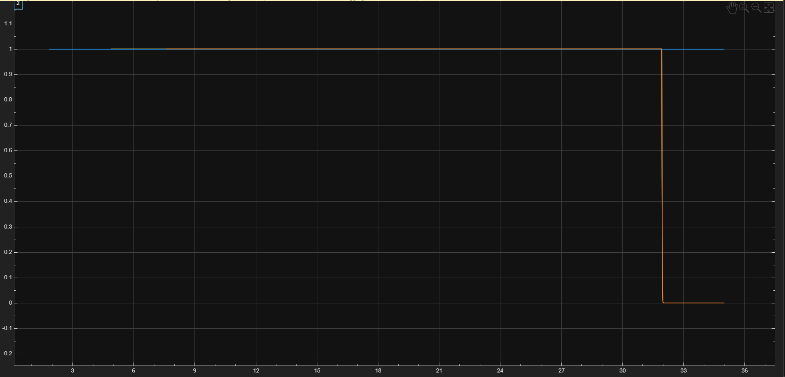
   
  <em>Fig. 11. Battery charging current profile over 35 s showing constant 1.0 A regulation during CC mode followed by sharp cutoff upon CV entry.</em>

---

## Engineering Problems Solved and Debugging Trajectory

1. **Algebraic Loop Elimination**:
   - *Symptom*: Simulink solver failed or reported algebraic loops involving CV PI, Min selector, and Simscape dependent switches.
   - *Solution*: Inserted a discrete Unit Delay block ($1/z$, $T_s = 10\ \mu\text{s}$, initial condition $0.35$) immediately after the Min block.
2. **Gain Tuning & Ripple Contamination**:
   - *Symptom*: High PI gains caused duty cycle hunting ($D \in [0.1, 0.7]$) as the integrator reacted to $100\text{ kHz}$ ripple rather than average current.
   - *Solution*: Introduced a 1st-order low-pass filter ($\tau = 100\ \mu\text{s}$, $f_c = 1.59\text{ kHz}$) and stabilized discrete PI gains at $K_p = 0.2, K_i = 50$.
3. **Solver Stiffness Optimization**:
   - *Symptom*: Standard Runge-Kutta solver (`ode45`) ground down to microsecond steps during switching transients.
   - *Solution*: Switched to `ode23t` (trapezoidal rule with free interpolation), accelerating simulation throughput by $>5\times$ while resolving clean triangular ripple waveforms.
4. **Target CV Alignment**:
   - *Symptom*: Setting $V_{ref} = 4.20\text{ V}$ against an OCV table topping out at $4.19\text{ V}$ led to steady-state current leakage and persistent integrator windup.
   - *Solution*: Aligned CV setpoint to the electrochemical table limit of $4.19\text{ V}$.

  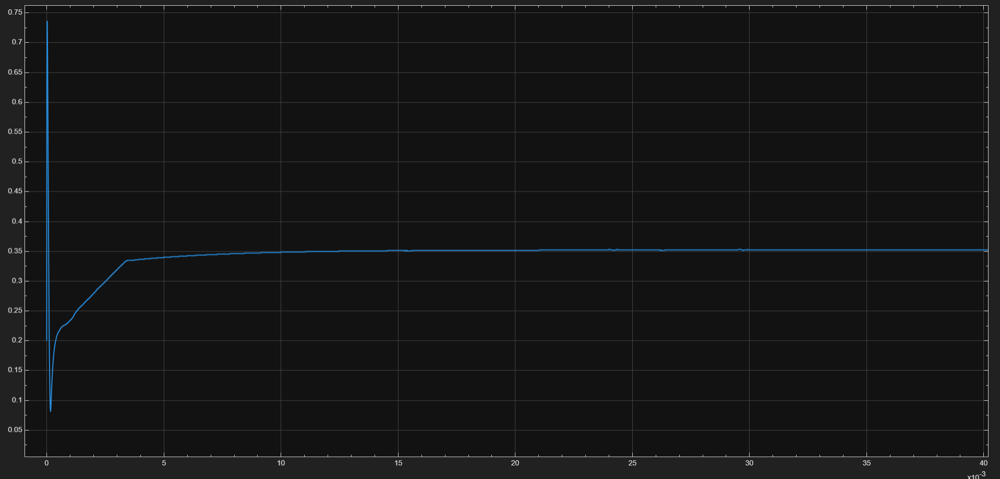
   
  <em>Fig. 12. Duty cycle hunting transient during early closed-loop PI tuning attempt prior to low-pass feedback filtering.</em>

---

## How to Run the Simulations

### Prerequisites
* MATLAB R2022b or later
* Simulink
* Simscape
* Simscape Electrical

### Execution Steps
1. **Detailed Switching Dynamics ($0 - 50\text{ ms}$)**:
   * Open `CV_CC_switched.slx` directly in MATLAB.
   * Ensure solver is configured to `ode23t` with relative tolerance `1e-3`.
   * Click **Run**.
   * Open `Scope Current` and `Scope_Voltage` to inspect $100\text{ kHz}$ triangular inductor ripple and $1\text{ A}$ current settling.
2. **Complete CC-to-CV Charging Cycle ($0 - 35\text{ s}$)**:
   * Open `CV_CC_sim_averaged.slx` directly in MATLAB.
   * Verify battery capacity is set to $0.01\text{ Ah}$ (accelerated mode) and stop time is $35\text{ s}$.
   * Click **Run**.
   * Open `Scope_D`, `Scope Current`, and `Scope_Voltage` to inspect the autonomous transition at $t \approx 32\text{ s}$.

---

## Model Limitations and Hardware Roadmap

### Model Assumptions & Limitations
* **Simplified Thermal Coupling**: Battery temperature is assumed isothermal ($293\text{ K}$). Internal Joule heating and convective cooling are omitted.
* **Electrochemical Degradation**: Solid Electrolyte Interphase (SEI) growth, capacity fade, and impedance rise over lifetime cycles are not represented.
* **Parasitics**: PCB trace inductances, MOSFET gate charge losses, and capacitor Equivalent Series Inductance (ESL) are neglected.

### Hardware Implementation Roadmap
For physical prototyping on an MCU (e.g., STM32 / TI C2000):
1. **Synchronous Rectification**: Replace the freewheeling diode with an active low-side N-channel MOSFET driven via dead-time complementary PWM to eliminate the $0.7\text{ V}$ drop and boost efficiency beyond $94\%$.
2. **Current Sensing**: Implement a low-side shunt resistor ($10\text{ m}\Omega$) with an INA240 bidirectional current sense amplifier feeding an ADC.
3. **Protection Firmware**:
   - Hardware comparator-driven cycle-by-cycle overcurrent trip ($I_{bat} > 1.5\text{ A}$).
   - NTC thermistor temperature cutoff ($T > 45^\circ\text{C}$).
   - Charge termination threshold ($I_{bat} < 0.05\text{ C} \implies 50\text{ mA}$).

---

## References

1. M. Chen and G. A. Rincon-Mora, "Accurate electrical battery model capable of predicting runtime and I-V performance," *IEEE Transactions on Energy Conversion*, vol. 21, no. 2, pp. 504–511, Jun. 2006.
2. J. Vetter et al., "Ageing mechanisms of Li-ion batteries," *Journal of Power Sources*, vol. 147, no. 1–2, pp. 269–281, Sep. 2005.
3. S. S. Zhang, "The effect of the charging protocol on the cycle life of a Li-ion battery," *Journal of Power Sources*, vol. 161, no. 2, pp. 1385–1391, Oct. 2006.
4. R. W. Erickson and D. Maksimovic, *Fundamentals of Power Electronics*, 3rd ed. Cham, Switzerland: Springer, 2020.
5. N. Mohan, T. M. Undeland, and W. P. Robbins, *Power Electronics: Converters, Applications, and Design*, 3rd ed. New York, NY: Wiley, 2003.
6. B. R. Lin, "Analysis and design of a digital battery charger with constant current and constant voltage," *IEEE Transactions on Industrial Electronics*, vol. 48, no. 2, pp. 332–341, Apr. 2001.
7. Texas Instruments, "Design considerations for lithium-ion battery chargers," Application Report SLVA444, 2011.
8. Analog Devices, "Switch-mode battery chargers: Design guide and topology tradeoffs," Technical Document AN-1088, 2018.
9. MathWorks, "Simscape Electrical User's Guide: Table-Based Battery Modeling and Parameterization," Natick, MA: The MathWorks Inc., 2023.
10. K. J. Astrom and R. M. Murray, *Feedback Systems: An Introduction for Scientists and Engineers*, 2nd ed. Princeton, NJ: Princeton University Press, 2021.

---
*Authored by **Shourya Khanna**, Department of Electronics and Telecommunication Engineering, Sardar Patel Institute of Technology, Andheri, Mumbai, Maharashtra, India.*  
*Project Repository: [https://github.com/Shouryak07/Buck-CC-CV-Li-ion-Charger](https://github.com/Shouryak07/Buck-CC-CV-Li-ion-Charger/tree/main)*  
*Research Paper: [Documentation/Buck_CC_CV_Li_Ion_Charger_Simulation_and_Control.pdf](Documentation/Buck_CC_CV_Li_Ion_Charger_Simulation_and_Control.pdf)*

